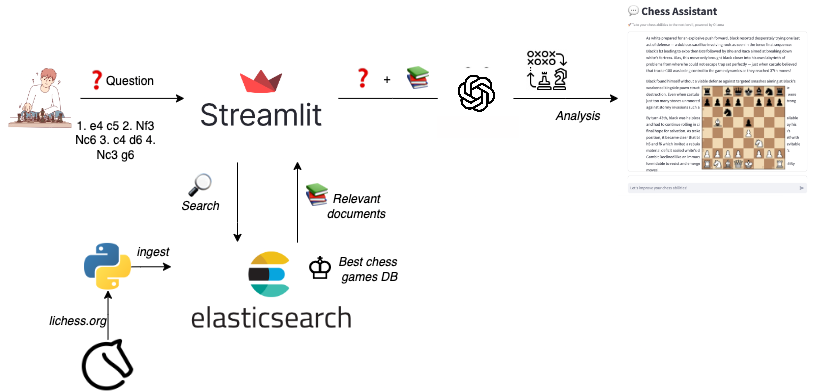

# ChessMate

ChessMate is an AI-powered chess coaching tool designed to help players of all levels improve their chess skills. Whether you're a beginner looking to learn the basics or an advanced player aiming to refine your strategies, ChessMate provides personalized insights by analyzing your games, identifying mistakes, suggesting optimal moves, and offering tailored practice puzzles. With an interactive chessboard and a modern tech stack, ChessMate makes chess improvement engaging and accessible.

<p align="center">
  
</p>

## Features

**Game Analysis**: Get detailed feedback on your games, pinpointing errors and inaccuracies with clear explanations of what went wrong and how to improve.

**Best Move Suggestions**: Discover the strongest moves played in your games and receive recommendations for optimal plays in key positions.

**Practice Puzzles**: Solve custom chess puzzles generated from real game positions, provided in FEN notation to enhance your tactical skills.

**Study Material**: Explore similar games from a vast database to deepen your understanding of specific openings and strategies.

**Interactive Chessboard**: Visualize and interact with chess positions directly in the app using a draggable chessboard interface.

## RAG Diagram

<p align="center">
  
</p>

## Technologies Used

ChessMate is built with a powerful and modern tech stack:

**Streamlit**: A Python framework for creating the interactive web application interface.

**PostgreSQL**: A robust relational database to store conversation history and user feedback.

**Elasticsearch**: A search engine for quickly retrieving relevant chess games based on moves and openings.

**OpenAI API**: Leverages advanced language models to generate insightful chess analysis and responses.

**Chessboard.js**: A JavaScript library for rendering an interactive chessboard within the app.

**Docker**: Containerizes the application and its dependencies for easy deployment and scalability.

**Grafana**: Used for monitoring 

## Setup and Installation

Follow these steps to set up ChessMate locally:

**Steps**

- **Clone the Repository**
``` bash
git clone https://github.com/yourusername/ChessMate.git
cd ChessMate
```

- **Set Up Environment Variables**
Create a .env file in the root directory with the following content:
``` env
OPENAI_API_KEY=your_openai_api_key
POSTGRES_DB=chess_assistant
POSTGRES_USER=chess_assistant
POSTGRES_PASSWORD=chess_assistant
ELASTIC_URL=http://localhost:9200
INDEX_NAME=chess-rag
STREAMLIT_PORT=8501
```
Replace ```your_openai_api_key``` with your actual OpenAI API key.

- **Build and Run Docker Containers**
``` bash
docker-compose up --build
```
This will start the Elasticsearch, PostgreSQL, and ChessMate application services.

- **Initialize the Database and Load Chess Data** 
Once the containers are running, initialize the database and load chess games into Elasticsearch:
``` bash
docker exec -it chess_assistant_app poetry run python utils/setup.py
```
This script sets up the database schema and indexes chess games from a PGN file.

- **Access the Application**
Open your browser and navigate to ```http://localhost:8501``` to start using ChessMate.

## Usage

ChessMate is intuitive and easy to use:

1. Start the App: After setup, access the web interface at http://localhost:8501.

2. Ask Questions: Enter chess-related questions or positions in the chat input (e.g., "Analyze my last game" or "What’s the best move here?").

3. Receive Insights: ChessMate will respond with detailed analysis, including errors, best moves, puzzles, and study material.

4. Interact with the Chessboard: Use the sidebar chessboard to set positions, play moves, or visualize suggestions.

5. Provide Feedback: Rate responses with thumbs up or down to help refine the system.

### Monitoring

<p align="center">
  
</p>

